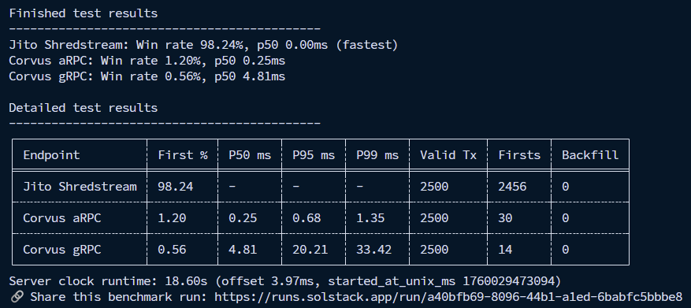

# GeyserBench

GeyserBench benchmarks the speed and reliability of Solana gRPC-compatible data feeds so you can compare providers with consistent metrics.

## Highlights

- Benchmark multiple feeds at once (Yellowstone, aRPC, Thor, Shredstream, Jetstream, and custom gRPC endpoints)
- Track first-detection share, latency percentiles (P50/P95/P99), valid transaction counts, and backfill events
- Stream results to the SolStack backend for shareable reports, or keep runs local with a single flag
- Generate a ready-to-edit TOML config on first launch; supply auth tokens and endpoints without code changes

## Installation

### Prebuilt binaries
- Download the latest release from the [GitHub releases page](https://github.com/solstackapp/geyserbench/releases) and place the binary on your `PATH`.

### Build from source
```bash
cargo build --release
```
The compiled binary is written to `target/release/geyserbench`.

## Quick Start

1. Run the binary once to scaffold `config.toml` in the current directory:
   ```bash
   ./target/release/geyserbench
   ```
2. Edit `config.toml` with the accounts, endpoints, and tokens you want to test.
3. Run the benchmark. Use `--config <PATH>` to point at another file or `--private` to disable backend streaming:
   ```bash
   ./target/release/geyserbench --private
   ```

During a run, GeyserBench prints progress updates followed by a side-by-side comparison table. When streaming is enabled the tool also returns a shareable link once the backend finalizes the report.

## Example Output



## Configuration Reference

`geyserbench` reads a single TOML file that defines the run parameters and endpoints:

```toml
[config]
transactions = 1000
account = "pAMMBay6oceH9fJKBRHGP5D4bD4sWpmSwMn52FMfXEA"
commitment = "processed"  # processed | confirmed | finalized

[[endpoint]]
name = "Jito Shredstream"
url = "http://localhost:10000"
kind = "shredstream"

[[endpoint]]
name = "Corvus aRPC"
url = "https://fra.corvus-labs.io:20202"
kind = "arpc"

[[endpoint]]
name = "Corvus gRPC"
url = "https://fra.corvus-labs.io:10101"
x_token = "optional-auth-token"
kind = "yellowstone"
```

- `config.transactions` sets how many signatures to evaluate (backend streaming automatically disables itself for extremely large runs).
- `config.account` is the pubkey monitored for transactions during the benchmark.
- `config.commitment` accepts `processed`, `confirmed`, or `finalized`.
- Repeat `[[endpoint]]` blocks for each feed. Supported `kind` values: `yellowstone`, `arpc`, `thor`, `shredstream`, `shreder`, and `jetstream`. `x_token` is optional.

## CLI Options

- `--config <PATH>` &mdash; load configuration from a different TOML file (defaults to `config.toml`).
- `--private` &mdash; keep results local by skipping the streaming backend, even when the run qualifies for sharing.
- `-h`, `--help` &mdash; show usage information.

Streaming is enabled by default for standard-sized runs and publishes to `https://runs.solstack.app`. You can always opt out with `--private` or by configuring the backend section to point at your own infrastructure.
